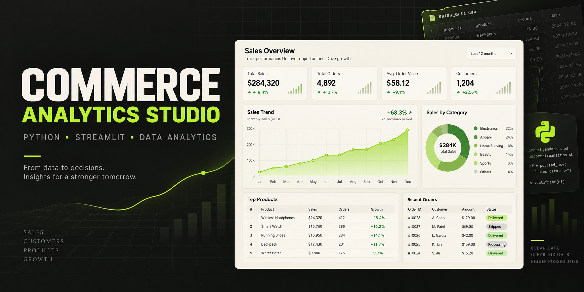

[](https://commerce-analytics-studio-bn2k6rmi3v6zpbv5mpt5sj.streamlit.app/)

[](https://commerce-analytics-studio-bn2k6rmi3v6zpbv5mpt5sj.streamlit.app/)

# Commerce Analytics Studio

A Python-powered sales analytics application that transforms CSV and Excel data into actionable e-commerce insights.

## What it does

- Uploads CSV or Excel sales files
- Cleans and validates commerce data
- Calculates revenue, order, unit and average-order metrics
- Visualizes monthly revenue, product performance and country distribution
- Detects low-stock products with an adjustable threshold
- Exports the complete analysis as an Excel workbook
- Includes fictional demo data so the dashboard works immediately

## Technology

`Python` · `Streamlit` · `Pandas` · `Plotly` · `OpenPyXL` · `Pytest`

## Run locally

```bash
python -m venv .venv
source .venv/bin/activate
pip install -r requirements.txt
streamlit run app.py
```

On Windows, activate the environment with `.venv\Scripts\activate`.

## Expected data columns

| Column | Meaning |
| --- | --- |
| `order_date` | Order date |
| `order_id` | Unique order identifier |
| `customer` | Customer or account name |
| `country` | Sales country |
| `product` | Product name |
| `category` | Product category |
| `quantity` | Units sold |
| `unit_price` | Price per unit |
| `stock` | Current inventory level |

Use [`data/sample_sales.csv`](data/sample_sales.csv) as an import template.

## Tests

```bash
pytest
```

## Privacy

Uploaded files are processed during the active Streamlit session. This portfolio version does not include a database or persistent upload storage.

## License

Released under the MIT License. All built-in business data is fictional and intended for demonstration only.
